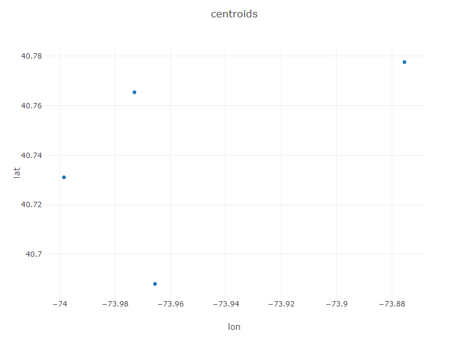

# New York City Uber Demand: K-Means Clustering with Smile + Tablesaw

In previous tutorials, we have covered two popular **supervised** learning techniques, linear regression and random forest classification. These techniques take a predefined set of features and predict a response. 

With K-Means, we introduce the notion of an **unsupervised** learning task, in this case with the desire to cluster observations into similiar groups without the input-output structure of regression or classification. 

Our reference text for this tutorial is Chapter 12 (Unsupervised Learning) of the widely used and freely available textbook, <a href="https://www.statlearning.com/">An Introduction to Statistical Learning, Second Edition</a>. The dataset comes from the <a href="https://data.fivethirtyeight.com/">FiveThirtyEight Repository</a> and additional tutorials covering this dataset can be found <a href="https://towardsdatascience.com/how-does-uber-use-clustering-43b21e3e6b7d">here</a> and <a href="https://www.linkedin.com/pulse/uber-trip-segmentation-using-k-means-clustering-khatre-csm-pmp/">here</a> . 


In K-Means clustering, every observation is assigned to a single cluster and a good cluster is one where the within-cluster variation is as low as possible. 

### K-Means Algorithm Intuition
```
 1. Randomly assign each observation to a cluster. 
 2. Until the clusters stop changing: 
 
      a. Compute each cluster's centroid.
      
      b. Reassign each observation to the cluster with the closest centroid. 
```
 
Essentially, this becomes a computationally-intensive optimization problem to which K-means provides a locally optimal solution. Because K-means provides a local optimal via a greedy algorithm, its results may be heavily influenced by the random assignment in step 1. (In practice, Smile uses a variation of the algorithm known as <a href="https://en.wikipedia.org/wiki/K-means%2B%2B?msclkid=4118fed8b9c211ecb86802b7ac83b079#Improved_initialization_algorithm">K-means++</a> that strategically selects initial clusters to minimize this initialization bias)
 
 ### K-Means with NYC Uber Data
 
Because the K-means algorithm clusters datapoints, we can use it to determine ideal locations for Uber drivers to idle between customer pickups. The data in uber-pickups-april14.csv represents all Uber pickups in New York City during April 2014. To start, create a bounding box around the data to focus on Manhatten and the immediate vicinity. Download the data [here](https://github.com/jtablesaw/tablesaw/blob/8c03426f73cfa432ac563d5a6cb69bebdfea056a/data/uber-pickups-apr14.csv).
 
 ```Java
 Table pickups = Table.read().csv("uber-pickups-apr14.csv");

pickups = pickups.dropWhere(pickups.doubleColumn("lat").isGreaterThan(40.91));
pickups = pickups.dropWhere(pickups.doubleColumn("lat").isLessThan(40.50));

pickups = pickups.dropWhere(pickups.doubleColumn("lon").isGreaterThan(-73.8));
pickups = pickups.dropWhere(pickups.doubleColumn("lon").isLessThan(-74.05));
 ```
 
 Now, randomly select a subset of 100,000 records to work with. (This is purely to speed up plotting of the clusters). 
 
 ```Java
 pickups = pickups.sampleN(100000);
 ```
 
 Format the existing Date/Time Text Column as two new columns, a LocalDateTimeColumn and a LocalTime Column. 
 
 ```Java
 List<String> dateTimes = pickups.textColumn("Date/Time").asList();

DateTimeColumn dateTimesAsLocalDateTime = DateTimeColumn.create("PickupDateTime");
TimeColumn timeAsTimeColumn = TimeColumn.create("PickupTime");

for(String dt: dateTimes)
 {
   dateTimesAsLocalDateTime.append(LocalDateTime.parse(dt, DateTimeFormatter.ofPattern("M/d/yyyy H:m")));
   timeAsTimeColumn.append(LocalDateTime.parse(dt, DateTimeFormatter.ofPattern("M/d/yyyy H:m")).toLocalTime());
 }
 
 pickups = pickups.replaceColumn("Date/Time", dateTimesAsLocalDateTime);
 pickups.addColumns(timeAsTimeColumn);
 ```
 
 Print out a portion of your data to verify that it is in the correct format. 
 ```Java
 System.out.println(pickups);
 
 >                          uber-pickups-apr14.csv                            
     PickupDateTime       |    Lat    |    Lon     |   Base   |  PickupTime  |
------------------------------------------------------------------------------
 2014-04-01T00:28:00.000  |  40.7588  |  -73.9776  |  B02512  |    00:28:00  |
 2014-04-01T00:33:00.000  |  40.7594  |  -73.9722  |  B02512  |    00:33:00  |
 2014-04-01T01:19:00.000  |  40.7256  |  -73.9869  |  B02512  |    01:19:00  |
 2014-04-01T01:49:00.000  |  40.7271  |  -73.9803  |  B02512  |    01:49:00  |
 ```
 
 Train an initial K-means model with three clusters. 
 
 ```Java
KMeans model = KMeans.fit(pickups.as().doubleMatrix(),3);
Table plot_data = pickups.copy();
plot_data.addColumns(IntColumn.create("cluster",model.y));
Plot.show(ScatterPlot.create("K=3", plot_data, "lon", "lat", "cluster"));
 ```
 
Your plot should look similiar to the following. You can clearly see the three selected clusters represented by the color of each pickup location. (Notice that the data mirrors the shape of Manhatten and the surrounding area)
 
 <p align="center">

</p>
 
A practical issue encountered when using the K-means algorithm is the choice of the number of clusters, k. A common approach is to create an "Elbow Curve", which is a plot of the distortion (sum of squared distances from the centroid of a cluster) against chosen values of k. Let's create an Elbow Curve for each value of k from 2,10). 
 
 ```Java
Table elbowTable = Table.create("Elbow", DoubleColumn.create("Distortion", 10));
elbowTable.addColumns(IntColumn.create("k", 10));
for(int k = 2; k < 10; k++)
 {
   KMeans model2 = KMeans.fit(pickups.as().doubleMatrix(),k);
   elbowTable.doubleColumn("Distortion").set(k, model2.distortion);
   elbowTable.intColumn("k").set(k, k);
 }

Plot.show(LinePlot.create("Distortion vs K", elbowTable, "k", "distortion"));
 ```
 
Your curve should look something like the image below. We are looking for a hard break in the curve at a value of k where the distortion flattens out. (Hence the name, *Elbow Curve*)
 
<p align="center">

</p>
 
 Based on this curve, I will choose k=4. Generate a new model with k=4. This time, generate an additional plot showing the centroids of each region. 
 
 ```Java
 KMeans modelBest = KMeans.fit(pickups.as().doubleMatrix(),4);
Table plot_data_best = pickups.copy();
plot_data_best.addColumns(IntColumn.create("cluster",modelBest.y));
Plot.show(ScatterPlot.create("K=4", plot_data_best, "lon", "lat", "cluster"));

Table centTable = Table.create("Centroids",DoubleColumn.create("lat", modelBest.centroids.length), DoubleColumn.create("lon", modelBest.centroids.length));

for(int i = 0; i < modelBest.centroids.length; i++)
 {
  centTable.doubleColumn("lat").set(i, modelBest.centroids[i][0]);
  centTable.doubleColumn("lon").set(i, modelBest.centroids[i][1]);
 }

Plot.show(ScatterPlot.create("centroids", centTable, "lon", "lat"));
 ```
 
 We now have a reasonable assessment of where idled Uber drivers should congregated as they wait for their next pickup: the centroids of our 4 regions. 
 

 <p align="center">
 
</p>
 
So far in our analysis, we have sought to develop a general recommendation for where a driver should idle irrespective of the day of the week or time of the day. Now, let's look at how day of week and time of day impact customer pickup requests. For brevity, I will use k=5 for all of these scenarios. In practice, one would ideally generate an Elbow curve for each subset of the data. 

**Late Night (11 pm-5 am)**

```Java
//Late Night (11 pm-5 am)
Table lateNight = pickups.where(pickups.timeColumn("PickupTime").isAfter(LocalTime.of(23,0)).or(pickups.timeColumn("PickupTime").isBefore(LocalTime.of(5,0))));
KMeans modelLateNight = KMeans.fit(lateNight.as().doubleMatrix(),5);
Table plot_data_lateNight = lateNight.copy();
plot_data_lateNight.addColumns(IntColumn.create("cluster",modelLateNight.y));
Plot.show(ScatterPlot.create("Late Night, K=5", plot_data_lateNight, "lon", "lat", "cluster"));
```

**Weekday Mornings and Evenings**
```Java
  Table weekdays = pickups.where(pickups.dateTimeColumn("PickupDateTime")
                .isMonday()
                .or(pickups.dateTimeColumn("PickupDateTime").isTuesday())
                .or(pickups.dateTimeColumn("PickupDateTime").isWednesday())
                .or(pickups.dateTimeColumn("PickupDateTime").isThursday()));

//Weekday Morning (M-Th, 6 am-10 am)
Table weekdayMorning = weekdays.where(weekdays.timeColumn("PickupTime").isAfter(LocalTime.of(6, 0))
   .and(weekdays.timeColumn("PickupTime").isBefore(LocalTime.of(10,0))));
KMeans modelWeekdayMorning = KMeans.fit(weekdayMorning.as().doubleMatrix(),5);
Table plot_data_WeekdayMorning = weekdayMorning.copy();
plot_data_WeekdayMorning.addColumns(IntColumn.create("cluster",modelWeekdayMorning.y));
Plot.show(ScatterPlot.create("Weekday Morning, K=5", plot_data_WeekdayMorning, "lon", "lat", "cluster"));
//Weekday Evening (M-Th, 5 pm-10 pm)
Table weekdayEvening =  weekdays.where(weekdays.timeColumn("PickupTime").isAfter(LocalTime.of(17, 0))
   .and(weekdays.timeColumn("PickupTime").isBefore(LocalTime.of(22,0))));

KMeans modelWeekdayEvening = KMeans.fit(weekdayEvening.as().doubleMatrix(),5);
Table plot_data_WeekdayEvening = weekdayEvening.copy();
plot_data_WeekdayEvening.addColumns(IntColumn.create("cluster",modelWeekdayEvening.y));
Plot.show(ScatterPlot.create("Weekday Evening, K=5", plot_data_WeekdayEvening, "lon", "lat", "cluster")); 
```

**Weekends**
```Java
 //Weekend
Table weekend =  pickups.where(pickups.dateTimeColumn("PickupDateTime")
                 .isSaturday()
                 .or(pickups.dateTimeColumn("PickupDateTime").isSunday()));

KMeans modelWeekend = KMeans.fit(weekend.as().doubleMatrix(),5);
Table plot_data_Weekend = weekend.copy();
plot_data_Weekend.addColumns(IntColumn.create("cluster",modelWeekend.y));
Plot.show(ScatterPlot.create("Weekend, K=5", plot_data_Weekend, "lon", "lat", "cluster"));              
 ```

### Time Based Clusters
  <p align="center">
 
</p>

  <p align="center">
 
</p>

### Conclusions
These clusters reveal some interesting trends. Weekday mornings and evenings, for example, the algorithm suggests that most drivers should be awaiting passengers in Lower Manhatten. This is consistent with a weekday rushhour in the financial district of the city. Late night, however, is a very different story. The number of clusters in Manhatten drops from 3 to 2, and the largest geographic extent of demand in Manhatten is clustered around upper Manhatten and tourist/leisure areas such as Times Square and 5th Avenue. There are certainly a variety of potential explanations beyond what has been offered here for this variation, but regardless of the underlying reason for these variations the K-means algorithm has effectively addressed our question of interest--where do Uber drivers need to be at certain time/day to efficiently serve demand for Ubers in NYC. 

### Extensions

**Possible areas for further exploration:**

1. Alternative time windows/k-values to search for other time-based variations. 
2. Apply Smile's extensions of K-means, (<a href="https://haifengl.github.io/clustering.html?msclkid=fad0d344ba5f11ecb024703bc12a87be">X-means</a> and <a href="https://haifengl.github.io/clustering.html?msclkid=fad0d344ba5f11ecb024703bc12a87be">G-means</a>) that attempt to address the issue of determining k.
3. K-means can be thought of as a version of the classical facility location problem in the field of Operations Research where the candidate facility locations are undefined. One shortcoming of the K-means approach, however, is that it does not consider geographical constraints that make driving from one place to another more difficult than Euclidean distance would suggest. Use K-means to identify potential facility locations and then model this problem as the <a href="https://haifengl.github.io/clustering.html?msclkid=fad0d344ba5f11ecb024703bc12a87be">uncapacitated facility location</a> problem with additional constraints preventing pickups from one side of a waterway being served by a centroid on the other. Open source packages such as <a href="https://developers.google.com/optimization/?msclkid=4c2e5150ba6211ecbbb3ff46615f0eb3">Google OR-Tools</a> can be used to formulate and solve such problems in a Java environment. 
